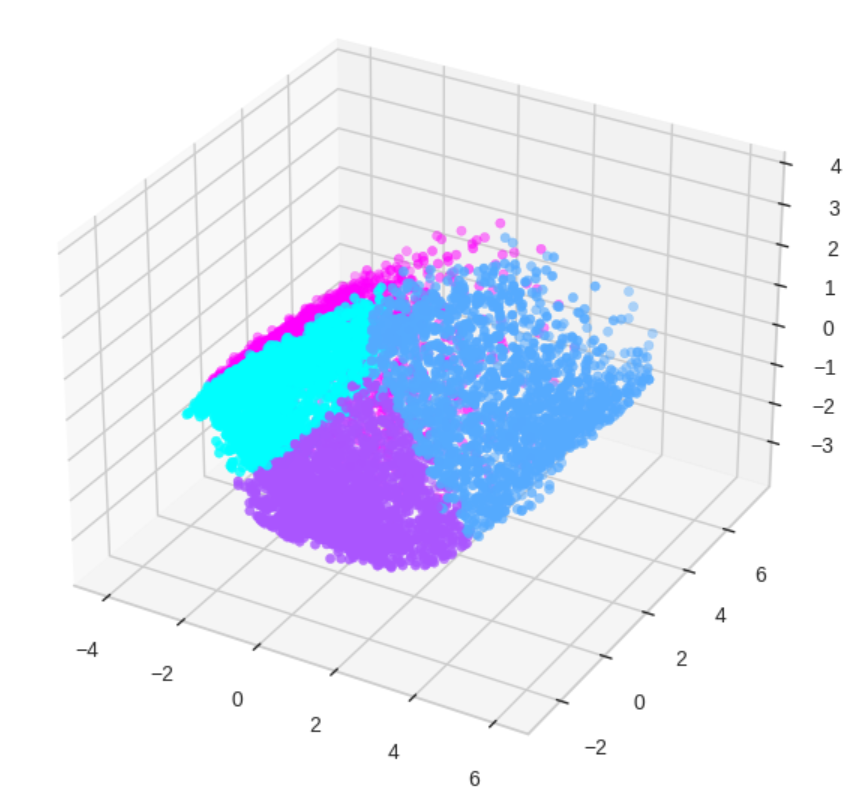

# Credit Card Customer Segmentation

In this project, the objective is to segment a portfolio of credit card users according to usage characteristics. Customer segmentation is then used by marketing department to tailor products and services specific to these customer segments. 

# Project structure
- Data exploration.
  - Data wrangling and cleaning
  - Data analysis and visualization for salient elements, trends and correlations
- K-means application. Optimal number of segments are determined using Elbow method.
- PCA (Principal Composant Analysis). Apply dimensionality reduction.

# Results

Identified customer segments:
- **Group 0**: Have a low balance but still have relatively high purchases happening mostly in installments.  These are good customers and even with less balance are managing to purchase So we should give them schemes where they can have discounts on some expensive products so that they are attracted to buy more stuff since they are frequent buyers. There are quite a number of people in this group so the company should definitely focus more on them.
- **Group 1**: These are customers with a relatively high balance that do alot of purchases. They have a high credit limit and are very active. The company should focus on not losing them.
- **Group 2**: They are rich people with a lot of balance but not frequent buyers. Even with a lot of balance they still take a lot of cash advance to purchase suggesting that they buy expensive items. They are few in quantity. In order to make them shell their money we need to provide them schemes for expensive items as well as the ordinary ones which they are not buying using the credit card. 
- **Group 3**: Their balance is less and don’t do purchases. They only buy the necessities and don’t take the cash advance and installments to do so. They are a lot. Focus a lot on them as they are a lot in number and aren't giving much profits. Come up with the schemes that make them comfortable to make purchases in installments and by taking cash advances.

Key segment characteristics:

The picture shows the dataset projection on two principal component axis after dimensionality reduction towards 2D feature space (from 17 features to 2 features). These two dimensions retain 48% of the total variance of the dataset. The axes represents the direction of maximum variance in the data (eigen vectors).

